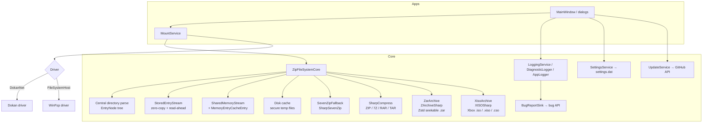

# Architecture

## Solution layout

Five projects (solution `CSharp_SimpleZipDrive.sln`, all `net10.0-windows`, SDK pinned via `global.json`):

| Project | Kind | Role |
|---|---|---|
| `SimpleZipDrive` | WPF exe | Dokan variant: UI + DokanNet mount service + Dokan `IDokanOperations` implementation (`ZipFs.cs`) |
| `SimpleZipDrive_WinFsp` | WPF exe | WinFsp variant: same UI + `FileSystemHost`-based mount service + WinFsp `IFileSystem` implementation (`ZipFs.cs`) |
| `SimpleZipDrive.Core` | class library | Shared engine: archive parsing, caches, streams, services, dialogs, logging, error reporting |
| `SimpleZipDrive.Tests` | xUnit | 952 `[Fact]` + 54 `[Theory]` methods (≈1,245 test cases); a `WinFsp\` mirror of the service tests; `Fakes\` for driver/report doubles |
| `FileBenchmark` | console exe | Cold-I/O benchmark tool (standby-list purge, XXH3 hashing) |

The WinFsp app project contains a custom MSBuild target, `KeepWinFspInteropOutOfBundle`, that is *essential* for packaged builds — see [Building & Packaging](building-and-packaging#packaging-internals).

## Component overview

## Mount flow (both variants)

1. `MainWindow.ProcessCommandLineArgsAsync` classifies: 1 arg = drag-and-drop, ≥2 args = archive + mount point.
2. `MountService.MountAsync` guards (one mount per instance, file exists, extension supported).
3. Mount-point resolution ([Mounting](mounting#mount-point-resolution)) → `MountWithAutoDriveLetterAsync` / `MountWithSpecifiedPointAsync` / `MountWithCrossIntegrityFolderAsync`.
4. Pre-mount checks (driver presence/version/service, mount-point availability, elevation).
5. `OpenArchiveFileStreamAsync` opens the archive with `FileShare.ReadWrite` (3 attempts, awaited backoff).
6. `ZipFileSystemCore` opens the archive through SharpCompress (ZIP/7Z/RAR/TAR) or the dedicated `ZarArchive` / `XisoArchive` adapters (`.zar` / Xbox images), parses the entry list, builds the `EntryNode` tree (including **implicit directories** for every ancestor path), detects encryption, prompts/verifies the password if needed.
7. The driver object (`ZipFs` — Dokan `IDokanOperations` or WinFsp `IFileSystem`) is constructed and mounted **in-process**; the lifecycle task parks until unmount.
8. Unmount: cancel → driver unmount → 500 ms grace → dispose engine (caches, temp dir).

## The archive engine (`ZipFileSystemCore`)

- **Entry model:** `EntryNode` with `NormalizedPath` (`/dir/file.txt`, forward slashes, Unicode Form C), `CanonicalPath`, `IsDir`, optional `IArchiveEntry`, sizes and timestamps. Lookup dictionaries are ordinal-ignore-case; `.`/`..` are resolved; corrupt directories abort the mount with a corruption error.
- **Stream selection** (`OpenEntryStream`), in order:
  1. Failed entry → `null` (read error).
  2. **Stored fast path** — ZIP-only, non-encrypted, non-solid, `CompressionType.None` or `CompressedSize == Size` → `StoredEntryStream` window over the raw archive with `RandomAccess` positional reads and 4 MB read-ahead.
  3. **Large entry** (`size ≥ MaxMemoryPerFileMb`) → disk cache.
  4. **Small entry** → shared memory cache (`AcquireSharedMemoryStream` + `DecompressEntryToBuffer`).
  5. Decompression failure → SevenZip fallback → failed entry.
  For `.zar` and Xbox images the entry stream beneath these tiers is random-access (`ZarEntryStream` decodes only the touched zstd blocks; `XisoEntryStream`/XISOSharp read disc sectors and decode CISO blocks per read), so seeking within an entry never re-decompresses earlier data.
- **Memory cache:** `MemoryEntryCacheEntry { byte[] Buffer, RefCount, LastUsed }`; per-entry `SemaphoreSlim` serializes first decompression; `EvictColdMemoryEntries` evicts refcount-0 buffers LRU; total budget = 90 % of `TotalAvailableMemoryBytes`; over-budget/OOM → disk cache fallback. `SharedMemoryStream.Dispose` decrements the refcount; refcount-0 buffers stay warm.
- **Disk cache:** `TempDirectoryPath = %LOCALAPPDATA%\SimpleZipDrive\Temp\<pid>_<guid>`; secure temp files (current-user-only ACL); free-space check; reuse registry per session; recursive delete on dispose; orphan sweep (`CleanupOrphanedTempDirectories`) with PID + process-name guard.
- **Reads:** positional (`RandomAccess`) where possible, strictly sequential fallback for non-seekable sources; `ReadOnDemand` (WinFsp) services paging I/O without handle context using `ArrayPool<byte>.Shared`.

## Driver interop details

- **Dokan:** `DokanInstanceBuilder` + `DokanOptions.RemovableDrive`; version probe via `DokanVersion()` P/Invoke with a minimum-version gate (`dokan2.dll` **≥ 2.3.0** — DokanNet 2.3 requires the `DokanRegisterWaitForFileSystemClosed` export, older drivers crash with an uncatchable `EntryPointNotFoundException`); driver output piped through `DokanPrefixedLogger` (`[DokanNet] ` prefix); 2-retry loop on `DokanException` gated by `ErrorStatus` (only `Error`/`StartError` retry — deterministic failures like `MountError`/`DriverInstallError` skip it, and DokanNet messages are localized so text matching is unreliable); `MountError`/`DriveLetterError` get a dedicated *"Mount Point Unavailable"* dialog.
- **WinFsp:** `winfsp.net 2.1.25156` **pinned deliberately** — newer 2.2.x interops reject the stable 2.1 native driver (*"incorrect dll version (need 2.2, have 2.1)"*); `RequiredWinFspVersion = 2.1`; native DLL preloaded; `winfsp-msil.dll` interop assembly probed with `Assembly.Load` before every mount; `WinFsp.Launcher` service verified; `host.Mount(mountPoint, securityDescriptor, false, DebugLog=-1)` with a per-attempt native debug log; NTSTATUS→message mapping ([Mounting](mounting#mount-error-codes-winfsp)).
- **Packaging constraint:** winfsp-msil's static initializer calls `FileVersionInfo.GetVersionInfo(Assembly.Location)`, which is empty inside single-file bundles — hence `winfsp-msil.dll` must ship beside the exe ([Building & Packaging](building-and-packaging#packaging-internals)).

## Services and cross-cutting concerns

- **ServiceProvider:** static registry populated in `App.OnStartup` (Logging → Settings → Mount → Notifications → Screenshots → Update → Stats); disposed in reverse at exit.
- **Settings:** `AppSettings` JSON at `%LOCALAPPDATA%\SimpleZipDrive\settings.dat`; corrupt file → reported + reset.
- **Logging:** single Serilog pipeline (`AppLogger`): verbose → session file; Information+ → debugger; Warning+ → `BugReportSink` → bug API (filtered by `ErrorLogger.IsUserError`); UI pane via `LoggingService` (5000-entry cap, 100 ms dedupe); `DiagnosticLogger` facade with sections/headers.
- **Global exception handling:** WPF dispatcher / AppDomain / unobserved tasks → `ErrorLoggerStatic`; fatal reports posted synchronously (30 s) before exit; pending reports drained at shutdown (5 s).
- **Update check:** `releases/latest` GitHub API, `tag_name` regex compare, silent on failure.
- **Stats:** startup POST `{ applicationId, version }`; HTTP 429 ignored.

## Threading and shutdown

- Driver callbacks arrive on driver thread pools; the engine guards shared state with a global archive lock, a memory-cache lock (`System.Threading.Lock`), and per-entry semaphores; disposal is `Interlocked`-guarded and idempotent.
- The mount lifecycle parks on an infinite cancellable delay; unmount cancels it.
- Window-close shutdown races unmount against **5 s**, then a **3 s** watchdog calls `TerminateProcess(GetCurrentProcess(), 0)` (exit code 0) if teardown hangs; `App.OnExit` flushes logs and drains pending bug reports.

## Conventions

- Modern C# on .NET 10: file-scoped namespaces, collection expressions, `required` members, `System.Threading.Lock`, `System.IO.RandomAccess`.
- Clean-up enforced by Meziantou.Analyzer + Roslynator (all warnings resolved; dev-only packages).
- `InternalsVisibleTo` grants test access; `References\` holds third-party reference sources excluded from compilation.
