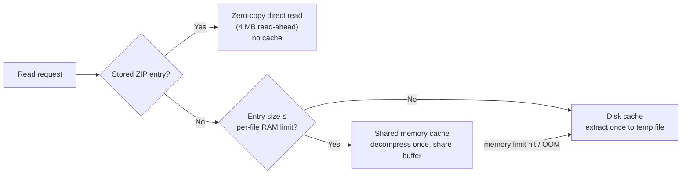

# The Caching Engine

SimpleZipDrive uses a hybrid, tiered caching design so that browsing feels local while keeping memory bounded.

## Tier overview

## 1. Zero-copy path for stored ZIP entries

A ZIP entry that is **stored** (not deflated), not encrypted, and not part of a solid archive is never decompressed at all. The reader opens a seekable window directly over the archive's bytes at the entry's data offset:

- Reads use `System.IO.RandomAccess` positional reads on the archive's file handle — no stream-position contention between concurrent readers.
- Sequential access triggers a **4 MB read-ahead** buffer.
- This gives near-native throughput (measured 500+ MB/s on SSDs) with a tiny, fixed memory footprint.

## 2. Shared memory cache for small entries

Compressed entries that fit within the per-entry memory limit are decompressed **exactly once** into an exact-size buffer:

- **Decompress-once, share across handles.** Every process opening the file gets its own read-only stream over the *same* buffer, with an atomic reference count. Opening the same file 100 times costs one decompression.
- **Warm buffers.** When the last handle closes, the buffer stays in the cache (reference count 0) so the next open is instant. It is evicted only when memory is needed — **LRU** by last-use time.
- **First decompression is serialized** per entry (a per-entry semaphore) — parallel opens do not duplicate work.
- **Exact-size buffers.** Decompression writes directly into the final buffer (no intermediate `MemoryStream` + `ToArray()` copy). This halved peak memory in 2.9.0: a 424 MB entry now peaks at ≈ one copy of the data instead of two.

**Limits:**

| Limit | Default / rule |
|---|---|
| Per-entry RAM limit | `MaxMemoryPerFileMb` setting, **512 MB** default, clamped to 1 MB … **90 % of installed RAM** |
| Total memory-cache budget | **90 % of total available memory** (`GC.GetGCMemoryInfo().TotalAvailableMemoryBytes`) |

When an allocation would exceed the total budget — or the system throws `OutOfMemoryException` — the entry **falls back to the disk cache** instead of failing (*"Memory limit approaching. Using disk cache for small file '…'"*).

> **Task Manager note:** the working set after first open is roughly *app base + file size* for the largest file you touched. The 2.9.0 fix removed the transient double allocation that made memory appear to "double" between runs (see [issue #10](https://github.com/purelogiccode/SimpleZipDrive/issues/10)).

## 3. Disk cache for large entries

Entries larger than the per-entry limit (or decompressed when memory is exhausted) are extracted **once** to a file in the session temp directory:

- Location: `%LOCALAPPDATA%\SimpleZipDrive\Temp\<pid>_<guid>\<n>.tmp` — one directory per mount session.
- Temp files are created with a secure ACL granting **full control to the current user only**.
- The extracted file is registered in an in-session cache and reused by all subsequent opens (*"Reusing existing temporary cache for '…'"*).
- Free disk space is checked first: *"Insufficient disk space to extract file '…'. Available: … Required: …"*.
- Reads come from the extracted file via regular file I/O, so Windows' own file cache accelerates repeat access.

## Cleanup

- **On unmount / exit:** the session's temp directory is deleted recursively; all disk-cache files are removed; the memory cache is cleared; per-entry semaphores are disposed.
- **On startup (orphan sweep):** directories matching `<pid>_<guid>` whose PID no longer exists — or whose PID was reused by a *different* process — are deleted. This cleans up after crashes without touching live sessions.
- **Manual:** the *Clean Temp Files* menu item runs the same sweep on demand.
- **Cross-integrity mount folders** (`%LOCALAPPDATA%\SimpleZipDrive\Mounts\…`) are *not* auto-deleted — empty folders may accumulate and can be removed manually.

## Tuning

- Lower `MaxMemoryPerFileMb` (e.g. 64–128) on RAM-constrained machines — larger files then go to the disk cache instead of RAM ([settings](configuration#settings-reference)).
- Keep it high (512+ MB) for fastest repeated access to big game/media files, provided you have the RAM.
- The zero-copy stored-entry path is unaffected by these limits — it never buffers the whole file.
