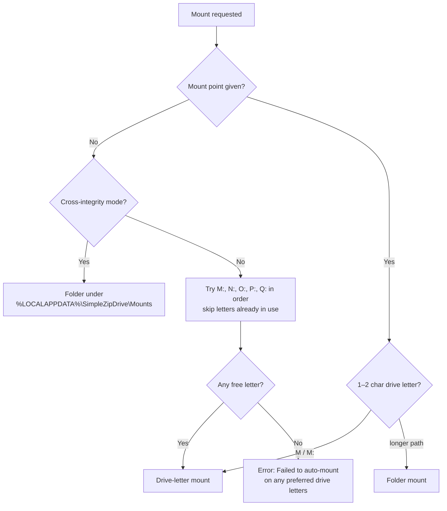

# Mounting in Depth

This page documents exactly how mount points are resolved, what happens before the driver is invoked, and how every failure is reported.

## Mount-point resolution

- **Drive-letter pool:** `M, N, O, P, Q` — tried in order. Occupied letters are skipped: *"Skipping 'M:\' (already in use)."*
- **Normalization:** a single letter (`M`) or `M:` is expanded to a full mount point (`M:` in the WinFsp variant, `M:\` in the Dokan variant). Any longer string is treated as a folder path — this distinction is deliberate; misclassifying absolute folder paths as drive letters historically caused mount failures (`0xC0000034`, fixed in 2.9.0).
- **Folder mounts** are created if missing (WinFsp) and write-tested with a probe file (`.sfz_test_<guid>`) before the mount.

## Pre-mount checks

| Check | Dokan variant | WinFsp variant |
|---|---|---|
| Archive exists / extension supported | ✔ | ✔ |
| Driver presence | `dokan2.dll` `DokanVersion()` P/Invoke; architecture mismatch (x64 driver on ARM64) detected | Native `winfsp-x64.dll`/`winfsp-x86.dll` preload |
| Driver service | — | `sc query WinFsp.Launcher` must report `RUNNING` |
| Driver version | `DokanVersion()` P/Invoke; **≥ 2.3.0 required** (DokanNet 2.3 needs the `DokanRegisterWaitForFileSystemClosed` export; older drivers crash with an uncatchable `EntryPointNotFoundException`), else *"Dokan Driver Outdated"* dialog | Registry `HKLM\SOFTWARE\WOW6432Node\WinFsp` (fallback `HKLM\SOFTWARE\WinFsp`) value `Version`; **≥ 2.1 required**, else *"WinFsp version mismatch: installed x.y, required 2.1. Mount blocked."* |
| WinFsp interop availability | — | `winfsp-msil.dll` beside the exe must be loadable, else *"Missing Application File"* dialog |
| Mount point availability | Letter free? | Letter free? Folder writable? |
| Archive opens / password | Central-directory parse; password prompt if encrypted (3 attempts) | Same |

## The mount itself

- **Both variants mount in-process.** No launcher executable is involved: the Dokan variant builds a `DokanInstance` inside the app (`DokanOptions.RemovableDrive`), the WinFsp variant calls `FileSystemHost.Mount(mountPoint, securityDescriptor, …)`.
- While mounted, the app parks the mount lifecycle task until unmount is requested. Closing the window unmounts.
- The archive file is opened with `FileShare.ReadWrite` so antivirus scanners or download managers holding the file do not block mounting; opening retries **3 times** with an awaited backoff (500 ms, then 1000 ms).

## Cross-integrity folder mounts (WinFsp)

Triggered when the app runs elevated (forced) or when the *Cross-integrity mount* setting is on:

1. Mount path = configured folder or default `%LOCALAPPDATA%\SimpleZipDrive\Mounts`, plus a subfolder named after the archive (sanitized: invalid characters stripped, max 200 chars, fallback name `SimpleZipDrive`).
2. The folder is created if missing.
3. A security descriptor **`D:P(A;;FA;;;WD)`** (protected DACL, Everyone → Full Access) is applied to the volume, and persistent ACLs are enabled on the host.
4. Drive-letter requests are redirected to the folder: *"Cross-integrity mode: Drive letter mounts are not supported. Redirecting to folder mount."*

Rationale: UAC integrity isolation would otherwise hide a mount created by an elevated process from standard processes (and vice versa). The permissive DACL trades isolation for visibility; see the [security discussion](security#cross-integrity-mounts).

## Mount error codes (WinFsp)

When `host.Mount` fails, the NTSTATUS code is mapped to a specific message:

| Status | Meaning | User-facing message |
|---|---|---|
| `0xC0000035` | Object-name collision | *"The mount point is already in use by another drive or process. Please choose a different drive letter or folder."* |
| `0xC0000034` | Object-name not found | *"The WinFsp driver was not found or is not running. Please install or start the WinFsp service."* |
| `0xC000003A` | Object-path not found | *"The mount point path was not found."* |
| `0xC0000022` | Access denied | *"Access denied. Please run as administrator or check permissions."* |
| `0xC000009A` | Insufficient resources | *"Insufficient system resources."* |
| `0xC0000038` | Device already exists | *"A device already exists at this mount point."* |
| `0xC000000E` | No such device | *"The WinFsp device is not available."* |
| other | — | *"Mount failed with status 0x… This may be caused by an outdated WinFsp driver."* |

`0xC0000035` additionally gets a dedicated *"Mount Point In Use"* dialog. Errors that indicate a broken driver installation open the [WinFsp releases page](https://github.com/winfsp/winfsp/releases).

## Dokan error handling

- `DokanException` triggers up to **2 retries** with a 1-second delay (*"Dokan driver error, retrying in 1s… (attempt 1/2)"*), except when the message contains *"Can't install"* (a hard driver-install failure).
- Missing or incompatible driver → *"Dokan Driver Not Found"* / *"Dokan Driver Incompatible"* dialog with a link to the [Dokan releases page](https://github.com/dokan-dev/dokany/releases).
- Outdated driver (dokan2.dll older than 2.3.0) → *"Dokan Driver Outdated"* dialog showing the installed and required versions, with a link to the [Dokan releases page](https://github.com/dokan-dev/dokany/releases).
- Without elevation the Dokan variant logs *"Warning: Running without Administrator privileges."* — mounting may still work for drive letters depending on your system configuration.

## Lifecycle and shutdown

- **Unmount:** cancels the mount task → driver unmount → 500 ms grace for pending callbacks → archive, caches, and temp directory disposed ([details](caching#cleanup)).
- **Window close:** shutdown races unmount against a **5 s** timeout; a **3 s** watchdog force-exits the process if teardown hangs (exit code 0).
- Mount folders created for cross-integrity mounts are **not** deleted on unmount (empty folders may remain — harmless).
